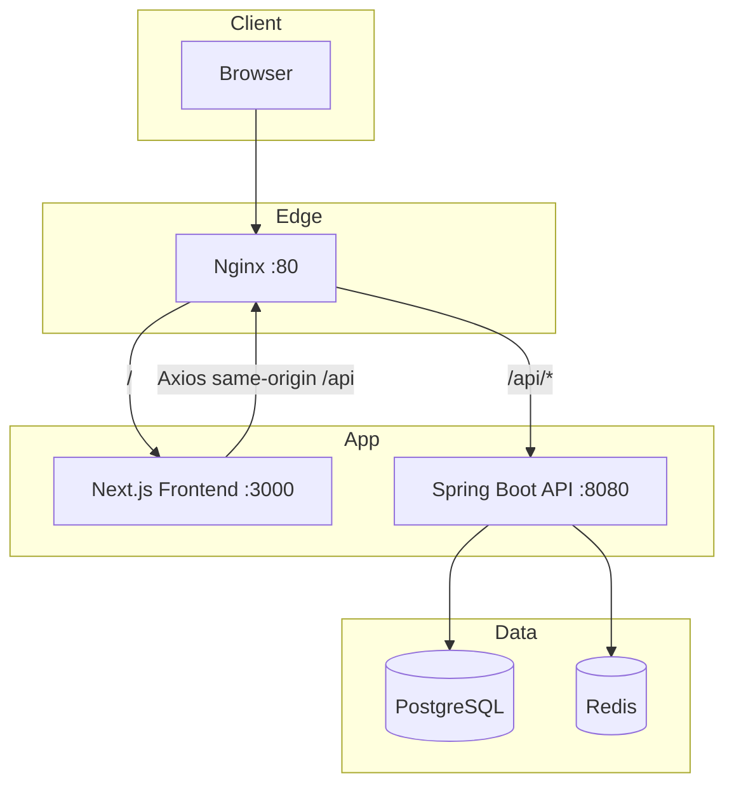
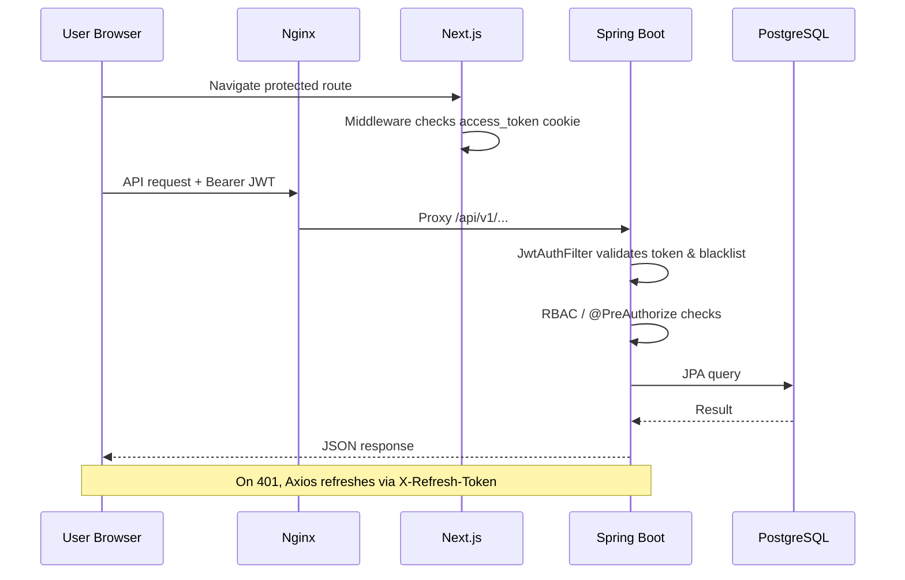
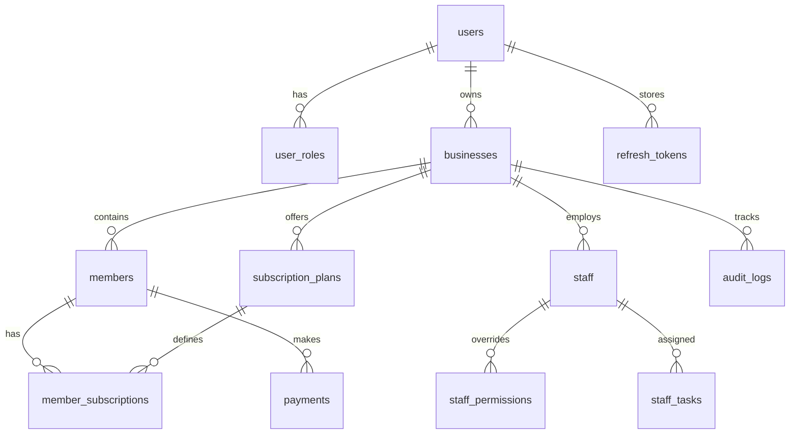
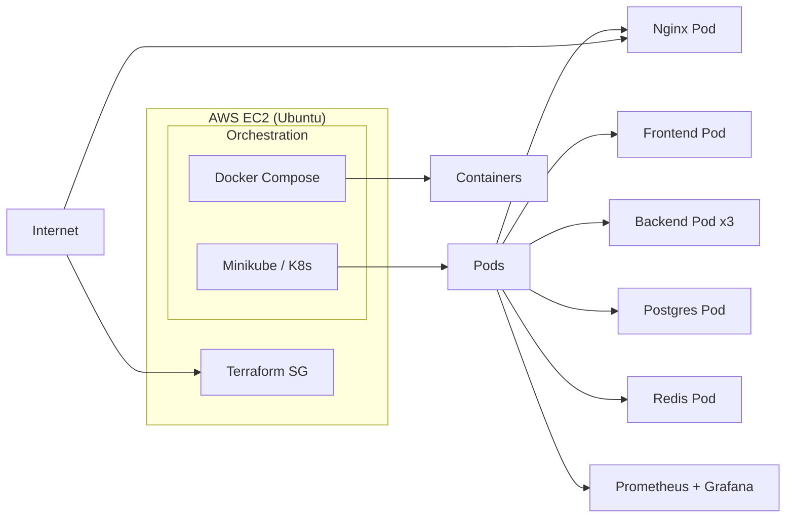

# Managio

**Multi-tenant gym & fitness studio management platform** — owners, staff, and members operate from dedicated portals backed by a production-grade Spring Boot API and a modern Next.js frontend.


---

## Table of Contents

- [Overview](#overview)
- [Key Features](#key-features)
- [Tech Stack](#tech-stack)
- [Architecture](#architecture)
- [Project Structure](#project-structure)
- [Screenshots](#screenshots)
- [Installation](#installation)
- [Environment Variables](#environment-variables)
- [Running Locally](#running-locally)
- [API Documentation](#api-documentation)
- [Database Design](#database-design)
- [Deployment](#deployment)
- [Performance Optimizations](#performance-optimizations)
- [Security Considerations](#security-considerations)
- [Challenges & Solutions](#challenges--solutions)
- [Future Enhancements](#future-enhancements)
- [Contributing](#contributing)
- [License](#license)
- [Author](#author)

---

## Overview

**Managio** is a full-stack SaaS product for membership-based businesses—gyms, fitness studios, yoga centers, and similar operators. A single **owner account** can manage **multiple businesses**, each with isolated members, staff, subscriptions, payments, tasks, and audit history.

The platform solves operational fragmentation: spreadsheets for members, ad-hoc payment tracking, unclear staff permissions, and missed subscription renewals. Managio centralizes these workflows with **role-based portals** (owner, staff, member), **JWT authentication**, **scheduled subscription lifecycle jobs**, and **exportable reporting**.

| Actor | Portal | Primary goals |
|--------|--------|----------------|
| **Owner** | `/dashboard`, `/businesses/*` | Multi-business oversight, analytics, staff & plan configuration |
| **Staff** | `/staff/*` | Day-to-day operations with granular permissions |
| **Member** | `/member/*` | Self-service subscription & payment visibility |

---

## Key Features

### Authentication & identity
- Stateless **JWT access tokens** (15 min default) + **refresh token rotation** stored in PostgreSQL
- Separate auth flows: **owner/user**, **staff** (business-scoped JWT claims), **member** self-service
- Email verification, password reset, account lockout, optional **OAuth2** client (disabled by default)
- Token blacklist: in-memory (single node) or **Redis** (multi-replica)

### Multi-business management
- Create, update, and soft-delete businesses per owner
- Business statistics and owner dashboard with revenue/member metrics

### Member management
- CRUD, search, status filters, profiles with subscription/payment history
- Bulk **CSV import/export** and import template download
- Member portal: login, dashboard, subscription & payments views

### Subscriptions
- Per-business subscription plans (price, duration)
- Assign plans to members; automatic expiry via **daily scheduler**
- Expiry reminder emails (7 / 3 / 1 days before end) — *email delivery requires mail provider configuration*

### Payments
- Manual payment recording with 12+ methods (Cash, UPI, cards, Razorpay, Stripe, etc.)
- Revenue analytics, method breakdown, recent payments, CSV export

### Staff & RBAC
- Roles: `OWNER`, `MANAGER`, `RECEPTIONIST`, `TRAINER`, `ACCOUNTANT`, `SALES`
- Per-staff permission overrides (grant/revoke)
- Email invitations with token-based acceptance
- Staff tasks module (priorities, due dates, assignment)
- Staff salary payment tracking (mark paid / unpaid lists)

### Dashboards & audit
- Owner, staff, and member dashboards
- Business-scoped audit logs with entity filtering

---

## Tech Stack

| Category | Technology | Notes |
|----------|------------|--------|
| **Frontend** | Next.js 15, React 18, TypeScript | App Router, `output: 'standalone'` for Docker |
| | Tailwind CSS, Radix UI, Framer Motion | Component library & animations |
| | TanStack Query, Zustand, React Hook Form, Zod | Data fetching, state, forms |
| | Recharts, Axios | Charts & HTTP client |
| **Backend** | Java 21, Spring Boot 3.3.5 | Modular monolith |
| | Spring Security, Spring Data JPA, Hibernate | Auth & persistence |
| | Spring Mail, OkHttp | Email & HTTP integrations |
| | spring-dotenv | `.env` loading in backend |
| **Database** | PostgreSQL 16 | Primary datastore |
| | Flyway | 16 versioned SQL migrations (`V1`–`V16`) |
| | H2 | Runtime dependency (tests/local fallback) — *no dedicated test suite in repo* |
| **Authentication** | JWT (JJWT 0.12.5), BCrypt(12) | Access + refresh, rotation, blacklist |
| | OAuth2 Client | Present in dependencies; `app.oauth.google.enabled=false` by default |
| **Caching** | Redis 7 | Token blacklist provider + Compose service |
| **DevOps** | Docker, Docker Compose | Multi-stage Dockerfiles for FE/BE |
| | Nginx (Alpine) | Reverse proxy: `/` → frontend, `/api/` → backend |
| | Kubernetes (Minikube) | Evidenced in deployment screenshots; manifests **not in this repository** |
| | Terraform | AWS security group provisioning (deployment artifact) |
| | Prometheus + Grafana | Monitoring stack on cluster (deployment artifact) |
| **Cloud services** | AWS EC2 | Ubuntu host (`ip-172-31-*` in deployment logs) |
| | Resend API | Transactional email (`RESEND_API_KEY`) |
| **APIs** | REST `/api/v1/*` | OpenAPI via SpringDoc |
| **Libraries** | libphonenumber | Phone validation |
| **Testing tools** | Not Found in Codebase | No `*Test.java` or frontend test scripts beyond `type-check` / `lint` |

---

## Architecture

Managio uses a **modular monolith** backend and a **Next.js SPA/SSR hybrid** frontend, deployed behind **Nginx** with path-based routing.

### System architecture



### Request flow (authenticated API call)



### Design decisions

| Decision | Rationale |
|----------|-----------|
| Modular monolith | Faster delivery for v1; clear domain packages (`auth`, `member`, `staff`, …) allow future extraction |
| Flyway + `ddl-auto=validate` | Schema safety in production; migrations are source of truth |
| Path-based API proxy (`/api/`) | Frontend uses `baseURL: "/"` — no CORS complexity in Docker/K8s |
| Separate auth namespaces | `/api/v1/auth`, `/api/v1/members/auth`, staff JWT with `businessId` |
| Redis optional blacklist | Supports horizontal scaling without sticky sessions |
| `open-in-view=false` | Prevents lazy-loading leaks outside transactions |

### Backend domain modules

```
auth · business · member · staff · subscription · payment · task · dashboard · audit · common
```

Each module follows: **Controller → Service → Repository → Entity/DTO**.

---

## Project Structure

```
Mangaio/                          # Repository root (product name: Managio)
├── README.md
├── docker-compose.yml            # Postgres, Redis, backend, frontend, nginx
├── nginx/
│   └── nginx.conf                # Reverse proxy rules
├── Deployment_images - Copy/     # Deployment & UI evidence screenshots
├── DEVOPS_DEPLOYMENT_ENGINEERING_REPORT.md
├── finalDevopsReport.pdf         # DevOps engineering report (PDF)
│
├── managio_frontend/             # Next.js 15 application
│   ├── app/
│   │   ├── (auth)/               # login, register, verify-email, reset-password
│   │   ├── (dashboard)/          # owner: businesses, dashboard, settings
│   │   ├── staff/                # staff portal
│   │   ├── member/               # member portal
│   │   └── page.tsx              # marketing landing page
│   ├── components/               # UI + shared components
│   ├── lib/
│   │   ├── api/                  # Axios client + domain API modules
│   │   ├── hooks/                # React Query hooks
│   │   └── store/                # Zustand (auth, business)
│   ├── middleware.ts             # Route protection by auth_type
│   ├── Dockerfile                # Multi-stage standalone build
│   └── package.json
│
└── managio_backend/              # Spring Boot API
    ├── src/main/java/com/nitin/saas/
    │   ├── auth/                 # Users, JWT, refresh tokens
    │   ├── business/
    │   ├── member/
    │   ├── staff/
    │   ├── subscription/         # Plans, assignments, schedulers
    │   ├── payment/
    │   ├── task/
    │   ├── dashboard/
    │   ├── audit/
    │   └── common/               # security, config, export, email
    ├── src/main/resources/
    │   ├── application.properties
    │   ├── application-dev.properties
    │   ├── application-docker.yml
    │   └── db/migration/         # Flyway V1–V16
    ├── Dockerfile                # Maven build → JRE 21 Alpine
    └── pom.xml
```

> **Note:** Kubernetes manifests (`~/k8s/*.yaml`), Jenkins pipelines, and Terraform `.tf` files appear in deployment screenshots but are **not present in this repository snapshot**.

---

## Screenshots

### Product & user experience

| | |
|:---:|:---:|
|  | **Landing page** — Multi-tenant positioning, feature highlights, and CTAs for owner onboarding. |
| *Marketing hero: "One Platform. Every Business."* | *Deployed preview accessed via cloud host (see Deployment).* |

### Owner & operations UI

The frontend implements dedicated surfaces for:

- **Owner dashboard** — revenue charts, member counts, subscription health (`app/(dashboard)/dashboard/page.tsx`)
- **Business management** — CRUD, statistics, audit logs
- **Members / subscriptions / payments** — tables, filters, CSV tools
- **Staff** — invitations, permissions, tasks, salary tracking
- **Staff portal** — streamlined operational views under `/staff/*`
- **Member portal** — dashboard, subscription, payments under `/member/*`

> Additional in-app UI screenshots: **Not Found in Codebase** (only deployment/infrastructure images are bundled). Run locally and capture dashboards for portfolio polish.

### Development & backend

| | |
|:---:|:---:|
|  | **Backend containerization** — Multi-stage Dockerfile (`maven:3.9.8-temurin-21` → `eclipse-temurin:21-jre-alpine`), non-root user, `app.jar` entrypoint. |
|  | **Flyway migrations** — 16 schema versions applied; JWT startup validation; Tomcat on port 8080 inside container. |

### Deployment & infrastructure

<details open>
<summary><strong>Cloud, Docker, Kubernetes, monitoring (click to shrink)</strong></summary>

| Screenshot | Caption |
|------------|---------|
|  | **AWS EC2 (Ubuntu)** — `systemctl enable/start docker`; Docker Engine active and ready for Compose/K8s workloads. |
|  | **Compose runtime** — `managio-nginx` + `managio-frontend` (Next.js 15) starting; Nginx entrypoint configures reverse proxy. |
|  | **Cluster tooling** — Docker verified; `kubectl` v1.30.1 and `minikube` v1.33.1 installed on Ubuntu host. |
|  | **Kubernetes layout** — Separate deployments/services for frontend, backend, nginx, postgres, redis (`~/k8s`). |
|  | **Minikube cluster** — Core pods Running (frontend, backend, postgres, redis); nginx required troubleshooting in this snapshot. |
|  | **Resilience** — Deleted backend pod recreated automatically by Deployment controller. |
|  | **Scaled backend** — 3 backend replicas; kube-prometheus stack (Prometheus, Grafana, Alertmanager) in cluster. |
|  | **Infrastructure as Code** — Terraform provisioning AWS security group (`devops_sg`) with ingress for SSH/HTTP. |
|  | **Observability** — `kubectl expose deployment grafana --type=NodePort --port=3000`. |
|  | **Cloud Native Monitoring Dashboard** — Pod health, frontend status, backend API, and Nginx proxy metrics. |

</details>

---

## Installation

### Prerequisites

| Tool | Version (verified in repo/logs) |
|------|----------------------------------|
| **Java** | 21+ |
| **Maven** | 3.9+ (or `./mvnw` in backend) |
| **Node.js** | 20+ |
| **PostgreSQL** | 16+ |
| **Redis** | 7+ (optional for dev; used in Compose & multi-pod blacklist) |
| **Docker & Docker Compose** | Latest stable (recommended) |

Optional (deployment workflow from project artifacts):

- AWS EC2 (Ubuntu), kubectl, minikube, Terraform, Prometheus/Grafana

### Clone

```bash
git clone <your-repository-url>
cd Mangaio
```

---

## Environment Variables

### Backend (`managio_backend`)

| Variable | Required | Default (from `application.properties`) | Description |
|----------|----------|----------------------------------------|-------------|
| `SPRING_PROFILES_ACTIVE` | No | `dev` | Active profile (`dev`, `docker`, …) |
| `DB_URL` | Yes* | `jdbc:postgresql://localhost:5432/managio` | JDBC URL |
| `DB_USERNAME` | Yes* | `managio_user` | Database user |
| `DB_PASSWORD` | Yes* | — | Database password |
| `JWT_SECRET` | **Yes** | placeholder | Access token HMAC secret (≥32 chars) |
| `JWT_REFRESH_SECRET` | **Yes** | placeholder | Refresh token secret (≥32 chars, distinct) |
| `REDIS_HOST` | No | `localhost` | Redis host |
| `REDIS_PORT` | No | `6379` | Redis port |
| `REDIS_PASSWORD` | No | empty | Redis password |
| `BLACKLIST_PROVIDER` | No | `memory` | `memory` or `redis` |
| `PORT` | No | `8082` | Server port (Compose sets `8080`) |
| `FRONTEND_URL` | Recommended | — | Links in emails (verification, reset) |
| `RESEND_API_KEY` | For email | — | Resend transactional API key |
| `MAIL_ENABLED` | No | — | Enable SMTP/Resend sending |
| `SMTP_HOST`, `SMTP_PORT`, `SMTP_USERNAME`, `SMTP_PASSWORD` | If using SMTP | — | Spring Mail |
| `OAUTH2_REDIRECT_URI` | If OAuth enabled | `http://localhost:3000/auth/callback` | OAuth callback |
| `TRUST_PROXY_HEADERS` | Prod behind proxy | `false` | Honor `X-Forwarded-*` |

\*Required for non-embedded PostgreSQL setups.

### Docker Compose (`docker-compose.yml`)

Compose injects `SPRING_DATASOURCE_*`, `JWT_SECRET`, `JWT_REFRESH_SECRET`, `REDIS_*`, `RESEND_API_KEY`, `app.frontend.url`. **Do not commit real secrets** — use a `.env` file and variable substitution in production.

### Frontend (`managio_frontend`)

| Variable | Required | Default in code | Description |
|----------|----------|-----------------|-------------|
| `NEXT_PUBLIC_API_BASE_URL` | No | Uses `"/"` via Axios | When not using Nginx proxy, set to backend origin (e.g. `http://localhost:8082`) |

> **Not Found in Codebase:** `.env.example` for frontend. Create `.env.local` manually if running Next.js dev server without Nginx.

---

## Running Locally

### Option A — Docker Compose (recommended)

```bash
# From repository root
docker compose up --build
```

| Service | URL |
|---------|-----|
| **Application (via Nginx)** | http://localhost |
| **API (proxied)** | http://localhost/api/v1/... |
| **PostgreSQL** | localhost:5432 |
| **Redis** | localhost:6379 |

Swagger UI (direct backend port if exposed): **Not exposed by default in Compose** (backend uses `expose: 8080` only). For API exploration, run backend locally on port 8082 or add a Compose port mapping.

### Option B — Manual (development)

**1. Database**

```bash
createdb managio
# Run as managio_user or adjust application-dev.properties
```

**2. Redis** (optional unless `BLACKLIST_PROVIDER=redis`)

```bash
redis-server
```

**3. Backend**

```bash
cd managio_backend
./mvnw spring-boot:run -Dspring-boot.run.profiles=dev
```

Default API: `http://localhost:8082` (per `application.properties` `PORT` default).

**4. Frontend**

```bash
cd managio_frontend
npm install
# If calling backend directly without Nginx:
# echo "NEXT_PUBLIC_API_BASE_URL=http://localhost:8082" > .env.local
npm run dev
```

Frontend dev server: `http://localhost:3000`

### Health & API docs

| Endpoint | URL |
|----------|-----|
| Health | `GET /api/health` |
| Info | `GET /api/info` |
| Swagger UI | `/swagger-ui.html` |
| OpenAPI JSON | `/api-docs` |

---

## API Documentation

Base path: **`/api/v1`**. Authenticated routes require:

```http
Authorization: Bearer <access_token>
```

Refresh:

```http
POST /api/v1/auth/refresh
X-Refresh-Token: <refresh_token>
```

<details>
<summary><strong>Authentication — <code>/api/v1/auth</code></strong></summary>

| Method | Endpoint | Auth | Description |
|--------|----------|------|-------------|
| POST | `/register` | Public | Register owner user |
| POST | `/login` | Public | Owner login |
| POST | `/staff/login` | Public | Staff login (business-scoped JWT) |
| POST | `/refresh` | Public | Rotate tokens |
| POST | `/logout` | Bearer + refresh | Revoke refresh; blacklist access |
| POST | `/verify-email` | Public | Verify email token |
| POST | `/resend-verification-email` | Public | Resend owner verification |
| POST | `/forgot-password` | Public | Request reset |
| POST | `/reset-password` | Public | Reset password (JSON body supported) |
| POST | `/change-password` | Bearer | Change password |
| GET | `/me` | Bearer | Current user profile |

**Login example**

```bash
curl -X POST http://localhost:8082/api/v1/auth/login \
  -H "Content-Type: application/json" \
  -d '{"email":"owner@example.com","password":"SecurePass1!"}'
```

**Response shape (illustrative)**

```json
{
  "accessToken": "eyJhbG...",
  "refreshToken": "uuid-or-token",
  "expiresIn": 900,
  "user": { "id": 1, "email": "owner@example.com" }
}
```

</details>

<details>
<summary><strong>Member auth — <code>/api/v1/members/auth</code></strong></summary>

| Method | Endpoint | Auth | Description |
|--------|----------|------|-------------|
| POST | `/register` | Public | Member self-registration |
| POST | `/login` | Public | Member login |
| POST | `/verify-email` | Public | Verify member email |
| POST | `/resend-verification` | Public | Resend member verification |
| POST | `/forgot-password` | Public | Member reset request |
| POST | `/reset-password` | Public | Member reset (JSON supported) |
| POST | `/change-password` | Bearer | Member password change |

</details>

<details>
<summary><strong>Business, members, subscriptions, payments, staff, tasks, audit, dashboards</strong></summary>

### Business — `/api/v1/businesses`

| Method | Endpoint | Description |
|--------|----------|-------------|
| POST | `/` | Create business |
| GET | `/my` | List owner's businesses |
| GET | `/{id}` | Get business |
| PUT | `/{id}` | Update business |
| DELETE | `/{id}` | Soft-delete |
| GET | `/{id}/statistics` | Aggregated stats |

### Members — `/api/v1/businesses/{businessId}/members`

| Method | Endpoint | Description |
|--------|----------|-------------|
| POST | `/` | Create member |
| GET | `/` | Paginated list |
| GET | `/with-subscriptions` | Members + subscription info |
| GET | `/search?query=` | Search |
| GET | `/status/{status}` | Filter by status |
| GET | `/{id}/profile` | Full profile |
| GET | `/{id}/subscription-history` | History |
| GET | `/{id}/payment-history` | Payments |
| GET | `/export` | CSV export |
| GET | `/import-template` | CSV template |
| POST | `/import` | Bulk CSV import |

### Subscriptions — `/api/v1/businesses/{businessId}/subscriptions`

| Method | Endpoint | Description |
|--------|----------|-------------|
| POST | `/plans` | Create plan |
| GET | `/plans` | List plans |
| POST | `/assign` | Assign to member |
| POST | `/{subscriptionId}/cancel` | Cancel subscription |
| GET | `/count` | Active count |

### Payments — `/api/v1/businesses/{businessId}/payments`

| Method | Endpoint | Description |
|--------|----------|-------------|
| POST | `/` | Record payment |
| GET | `/` | List (paginated) |
| GET | `/member/{memberId}` | Member history |
| GET | `/stats` | Method breakdown |
| GET | `/revenue/monthly` | Monthly revenue |
| GET | `/recent?days=7` | Recent payments |
| GET | `/export` | CSV export |

### Staff — `/api/v1/businesses/{businessId}/staff`

Includes CRUD, terminate/suspend/activate, permission grant/revoke, invitations, salary payment endpoints.

### Staff invitations — `/api/v1/staff`

| Method | Endpoint | Description |
|--------|----------|-------------|
| POST | `/accept-invitation` | Accept invite (public) |
| GET | `/invitation?token=` | Get invitation details (public) |

### Tasks — `/api/v1/businesses/{businessId}/tasks`

| Method | Endpoint | Description |
|--------|----------|-------------|
| GET | `/` | List tasks |
| GET | `/{taskId}` | Task detail |
| POST | `/` | Create task |

### Audit — `/api/v1/businesses/{businessId}/audit-logs`

| Method | Endpoint | Description |
|--------|----------|-------------|
| GET | `/` | Paginated logs |
| GET | `/entity/{entityType}` | Filter by entity |
| GET | `/recent?days=7` | Recent activity |

### Dashboards

| Method | Endpoint | Description |
|--------|----------|-------------|
| GET | `/api/v1/businesses/{businessId}/dashboard/owner` | Owner dashboard |
| GET | `/api/v1/businesses/{businessId}/dashboard/staff` | Staff dashboard |
| GET | `/api/v1/members/{memberId}/dashboard` | Member dashboard |

</details>

---

## Database Design

Schema is managed by **Flyway** (`managio_backend/src/main/resources/db/migration/`). Hibernate `ddl-auto=validate`.

### Entity relationship overview



### Core tables

| Table | Purpose |
|-------|---------|
| `users`, `user_roles` | Platform owners/admins |
| `refresh_tokens`, `email_verification_tokens`, `password_reset_tokens` | Auth tokens |
| `auth_audit_logs` | Security events |
| `businesses` | Tenant root entity |
| `members` | Business members (+ `public_id` from V15) |
| `subscription_plans`, `member_subscriptions` | Plans & assignments |
| `payments` | Payment records (+ reference, `paid_at` from V13) |
| `staff`, `staff_invitations`, `staff_permissions` | Workforce & RBAC |
| `staff_tasks` | Operational task tracking (V16) |
| `audit_logs` | Business audit trail (+ `entity_public_id`) |
| `member_password_reset_tokens` | Member-specific resets (V11) |

### Migration versions

| Version | File | Highlights |
|---------|------|------------|
| V1 | `create_users_and_auth_tables` | Users, roles, tokens, auth audit |
| V2–V3 | users/business/members | Business & member core |
| V4 | subscriptions | Plans & member subscriptions |
| V5 | payments | Payment ledger |
| V6 | staff | Staff, invitations, permissions |
| V7 | audit_logs | Audit module |
| V8 | business extended fields | Additional business metadata |
| V9, V12 | performance indexes | Query optimization |
| V10 | refresh token subject type | Multi-subject refresh tokens |
| V11 | member password reset | Member auth support |
| V13 | payment reference | Payment metadata |
| V14–V16 | public IDs, salary, tasks | IDs for external APIs, staff salary, tasks |

---

## Deployment

### Deployment architecture (as implemented & evidenced)



### Hosting & tooling

| Component | Evidence | In repository? |
|-----------|----------|----------------|
| **AWS EC2** | Ubuntu host `ip-172-31-40-6`, public IP in landing screenshot | Partial (`docker-compose.yml`) |
| **Docker Compose** | `docker-compose.yml`, local Compose logs | **Yes** |
| **Kubernetes (Minikube)** | `kubectl get pods`, `~/k8s` manifests | **No** (screenshots only) |
| **Terraform** | `terraform plan` for `aws_security_group.devops_sg` | **No** |
| **Prometheus + Grafana** | kube-prometheus pods, Grafana NodePort | **No** |
| **Nginx** | `nginx/nginx.conf`, K8s nginx deployment | **Yes** (Compose config) |
| **Jenkins CI/CD** | Mentioned in DevOps report | **Not Found in Codebase** |
| **GitHub Actions** | Recommended in DevOps report | **Not Found in Codebase** |

### Build process

**Backend**

```bash
cd managio_backend
docker build -t managio-backend:1.0 .
# Multi-stage: Maven 3.9.8 + Temurin 21 → JRE Alpine, non-root user
```

**Frontend**

```bash
cd managio_frontend
docker build -t managio-frontend:1.0 .
# Multi-stage: npm ci → next build (standalone) → node:20-alpine runner
```

**Full stack**

```bash
docker compose up --build -d
```

### Recommended EC2 sizing (from DevOps engineering analysis)

| Profile | Instance | Workloads |
|---------|----------|-----------|
| Minimum viable | `t3.medium` (2 vCPU, 4 GB) | FE + BE + Postgres |
| Recommended demo | `t3.large` (2 vCPU, 8 GB) | + Redis + monitoring |
| Full demo + CI | `t3.xlarge`+ | + Jenkins/heavier traffic |

### CI/CD workflow

**Not Found in Codebase.** Deployment screenshots document manual `kubectl` and Terraform steps. Recommended path from project DevOps report: **GitHub Actions** → build/test → push images → SSH/Compose or `kubectl rollout` deploy with health checks.

### Environment configuration (production checklist)

- [ ] Externalize all secrets (JWT, DB, Resend) via env/secret manager — never bake into images
- [ ] Set `BLACKLIST_PROVIDER=redis` when running **>1 backend replica**
- [ ] Configure `FRONTEND_URL` and HTTPS termination at Nginx/ALB
- [ ] Restrict security group ingress (avoid `0.0.0.0/0` on SSH in production)
- [ ] Enable mail (`app.mail.enabled`) for verification & subscription reminders
- [ ] Add Prometheus scrape targets (`/actuator/prometheus` — **Not Found in Codebase**; only `health,info` exposed today)

---

## Performance Optimizations

Verified in codebase:

| Optimization | Location / behavior |
|--------------|-------------------|
| **DB indexes** | Flyway `V9`, `V12` — member, subscription, audit query paths |
| **HikariCP pool tuning** | `maximum-pool-size=10`, leak detection, timeouts |
| **`open-in-view=false`** | Prevents N+1 session issues in web layer |
| **JWT iat jitter** | `JwtUtil` — avoids duplicate tokens on rapid re-login + blacklist |
| **Next.js `optimizePackageImports`** | `lucide-react`, `recharts`, `framer-motion` bundle trimming |
| **Standalone Docker output** | Smaller frontend runtime image |
| **Container-aware JVM** | `-XX:MaxRAMPercentage=75.0`, `UseContainerSupport` in Dockerfile |
| **Async thread pool** | `AsyncConfig` — core 10 / max 50 for `@Async` work |
| **Scheduled jobs off-peak** | Subscription expiry midnight; reminders 09:00 |
| **Redis token blacklist** | Optional distributed logout invalidation |

---

## Security Considerations

| Area | Implementation |
|------|----------------|
| **Authentication** | JWT access + refresh; BCrypt(12); refresh rotation & replay detection |
| **Authorization** | Spring `@EnableMethodSecurity`, staff permission matrix, business-scoped APIs |
| **Token revocation** | Logout blacklists access token; in-memory or Redis |
| **Account protection** | Lockout after 5 failed attempts (configurable duration) |
| **Rate limiting** | `RateLimitFilter` on sensitive auth endpoints |
| **Transport** | HSTS-ready headers via `SecurityHeadersFilter`; frontend sets `X-Frame-Options`, `X-Content-Type-Options` |
| **CORS** | Configurable allowed origins in `SecurityConfig` |
| **Validation** | Jakarta Validation on DTOs; phone validation via libphonenumber |
| **CSRF** | Disabled for stateless JWT API (documented Spring pattern) |
| **Secrets in repo** | `docker-compose.yml` contains example secrets — **rotate and use `.env` for any real deployment** |

**DevOps report findings (review before production):**

- Restrict Terraform/AWS SG ingress to known IPs
- Ensure password reset flows use **JSON bodies**, not query parameters, in all clients
- Align member `resend-verification` frontend calls with backend route `/api/v1/members/auth/resend-verification`

---

## Challenges & Solutions

| Challenge | Solution |
|-----------|----------|
| **Multi-tenant data isolation** | `business_id` on all tenant entities; APIs scoped by `{businessId}` path |
| **Three user types, one platform** | Separate auth namespaces + Next.js middleware routing by `auth_type` cookie |
| **Token reuse after logout** | Token blacklist with TTL; Redis provider for multi-pod consistency |
| **Schema evolution without downtime** | Flyway versioned migrations with `validate` mode |
| **Same-origin API in containers** | Nginx path proxy so frontend uses relative `/api` URLs |
| **Subscription revenue leakage** | Scheduled expiry job + reminder emails before `end_date` |
| **Operational accountability** | `audit_logs` + `auth_audit_logs` with indexed queries |
| **K8s nginx pod errors (observed)** | Deployment screenshots show troubleshooting cycle; health probes & config maps recommended |

---

## Future Enhancements

| Priority | Enhancement |
|----------|-------------|
| High | Commit K8s manifests & Terraform to repo; GitHub Actions CI/CD |
| High | Enable `/actuator/prometheus` + alerting rules (Grafana dashboards exist in deployment) |
| High | HTTPS / domain (`app.managio.in` referenced on landing mockup) |
| Medium | Payment gateway integration (Razorpay/Stripe enums exist; manual record today) |
| Medium | OAuth2 Google login (`app.oauth.google.enabled`) |
| Medium | Automated test suite (unit + integration + E2E) |
| Medium | `.env.example` files for frontend & Compose |
| Low | 2FA (`two_factor_enabled` on users table) |
| Low | AI/OpenCV service mentioned in DevOps report — **Not Found in Codebase** |

---

## Contributing

1. Fork the repository and create a feature branch: `git checkout -b feature/your-feature`
2. Follow existing conventions (domain packages on backend; `app/` routes on frontend)
3. Run `npm run lint` / `npm run type-check` (frontend) and `./mvnw clean package` (backend)
4. Ensure Flyway migrations are backward-compatible
5. Open a pull request with description, screenshots, and test plan

> Automated tests are not yet present — include manual verification steps in PRs.

---

## License

**Proprietary** — © 2026 Managio. All rights reserved.

---

## Author

**Your Name**

| | |
|---|---|
| LinkedIn | [linkedin.com/in/nitinr0306](https://www.linkedin.com/in/nitinr0306/) |
| GitHub | [github.com/Nitinr0306](https://github.com/Nitinr0306) |
| Portfolio | [nitinr0306-portfolio-business.vercel.app/](https://nitinr0306-portfolio-business.vercel.app/) |
| Email | nitinr0306@gmail.com |

---

<p align="center">
  <sub>Built with Spring Boot & Next.js·Managio v1.0.0</sub>
</p>
